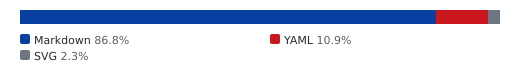
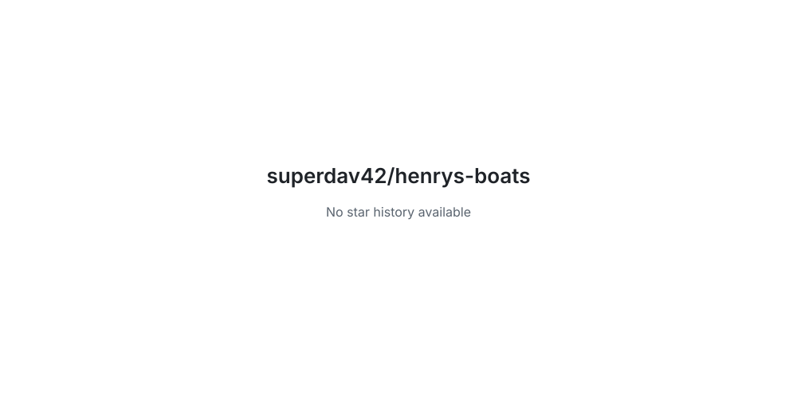

# Henry's Boats

<!-- aidevops:badges:start -->
<!-- managed by aidevops badges; edit the template, not this block -->
<!-- Build & Quality Status -->

<!-- License & Legal -->

<!-- Repository Metrics -->

<!-- Project Links -->

<!-- aidevops:badges:end -->

A Godot 4.7 2D mobile prototype for a turn-based boat combat game on a water grid.

## Current gameplay

- Tap one of your blue boats to select it.
- Win by capturing the enemy port or destroying every enemy unit.
- Tap an empty water square to move within that unit's movement range. Mountains are land tiles that only air units can enter.
- Tap a red enemy unit while one of your units is selected to attack.
- Coral reefs give water units 1 defense, reducing incoming damage by 1. Air units only receive defense on mountains, which give 2 defense.
- Your corner port can build Patrol Boats, Destroyers, Aircraft Carriers, and Anti-Air Boats.
- The Aircraft Carrier, or AC, can launch Jets, Fighters, and Bombers when selected.
- End your turn to let the enemy move or attack.
- Income each turn is based on fleet size and total kills, with a bounty when you sink an enemy.

## Custom maps

Use **Map Editor** during a match to create a working copy of a map. Choose an
approved square size, paint Water, Reef, and Mountain terrain, then place one
port for every consecutive team ID from 0 and optional starting units. A valid
map has 2–8 ports, unique port and unit cells, and no surface unit on a
mountain. Set the starting money before saving or using the map.

Saved maps live under Godot's `user://maps/` directory on native builds. Saving
an existing name requires the visible Replace option, and deleting a map
requires its own confirmation. The editor's JSON field is the portable format:
export to copy a version-1 JSON document, or paste JSON to import it. Invalid,
malformed, or future-version JSON is rejected without replacing the working or
saved map. Cancel discards only the editor's working copy.

## Requirements

- Godot 4.7.x

## Run locally

Run: godot --path .

Headless smoke check: godot --headless --path . --quit-after 1

## Play in a browser

Pushes to `main` export the Web preset and deploy it to GitHub Pages. The
workflow publishes the generated `site/` directory; it is not committed.

## Unit roles

- Patrol Boat/PT: cheap, fast close-range boat.
- Destroyer/DD: tougher boat with longer attack range.
- Aircraft Carrier/AC: expensive boat that can make Jet air units.
- Anti-Air Boat/AAB: long-range air defense; it cannot attack boats and deals 4 damage to aircraft.
- Jet/JET: fast air unit that can attack any unit.
- Fighter/FIG: air unit that can only attack aircraft.
- Bomber/BMB: hard-hitting air unit that cannot attack aircraft.

## Project layout

- project.godot: mobile-oriented project settings.
- scenes/main.tscn: main game scene.
- scripts/main.gd: grid, units, movement, combat, building, turns, and income.
- docs/mobile-notes.md: next steps for Android/iOS export setup.

<!-- aidevops:managed-readme:start -->
<!-- managed by aidevops; refresh with managed-readme-helper.sh sync -->
## Star History

## Built with aidevops

This project was created and is maintained with
[aidevops.sh](https://aidevops.sh).

[View superdav42 on GitHub](https://github.com/superdav42) ·
[aidevops repository](https://github.com/marcusquinn/aidevops)
<!-- aidevops:managed-readme:end -->
